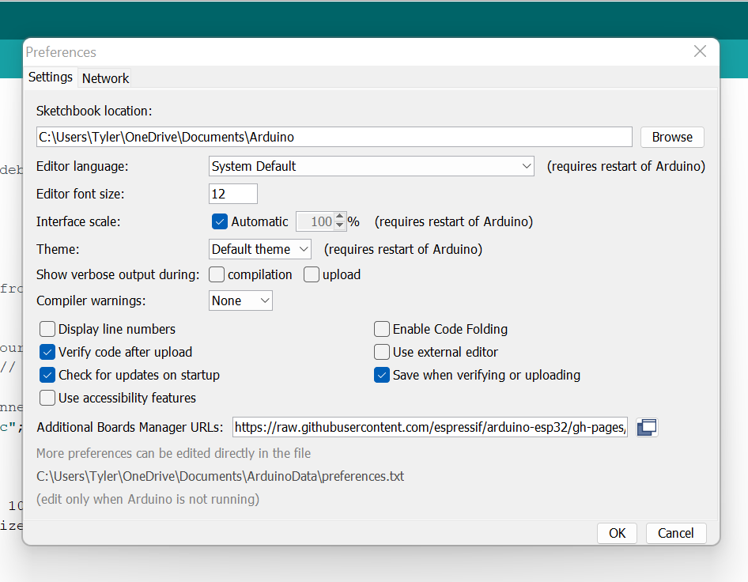
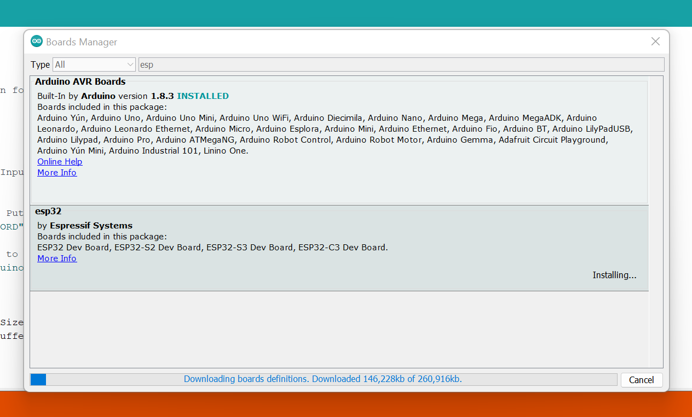

### Here is what you need to do to install the ESP32 boards into the Arduino IDE:

1. Open the Arduino IDE. Make sure that you are at version 1.8 or higher, if not then update your IDE with the latest version.
2. Click on the File menu on the top menu bar.
3. click on the preferences menu item. this will open a preferences dialog box.
4. You should be on the Settings tab in the Preferences dialog box by default.
5. Look for the textbox labeled “Additional Boards Manager URLs”.
6. If there is already text in this box add a coma at the end of it, then follow the next step.
7. Paste the following link into the text box  
`https://raw.githubusercontent.com/espressif/arduino-esp32/gh-pages/package_esp32_index.json`
8. Click the OK button to save the setting.

---
Next, you will need to use the new entry to actually add the ESPO32 boards to your Arduino IDE. You do that by following this procedure:

1. In the Arduino IDE click on the Tools menu on the top menu bar.
2. Scroll down to the Board: entry (i.e. Board: Arduino/Genuino Uno).
3. A submenu will open when you highlight the Board: entry.
4. At the top of the submenu is Boards Manager. Click on it to open the Boards Manager dialog box.
5. In the search box in the Boards Manager enter “esp32”.
6. You should see an entry for “esp32 by Espressif Systems”. Highlight this entry and click on the Install button.
7. This will install the ESP32 boards into your Arduino IDE

