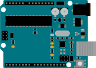
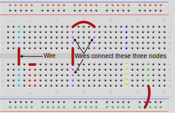
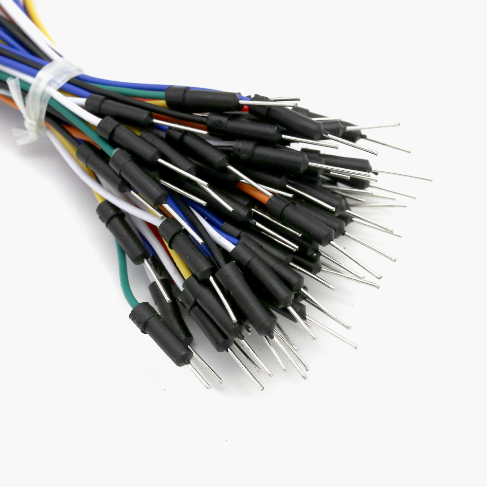
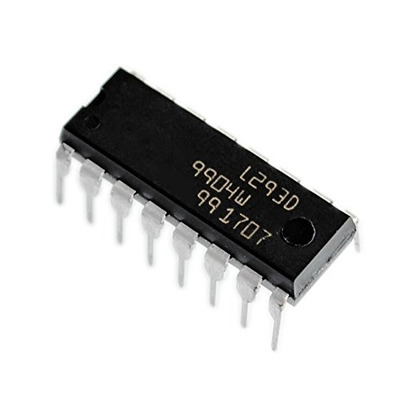
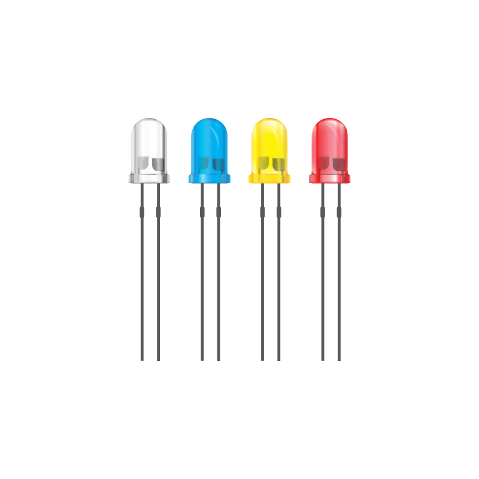

# 
 Hardware Design

 

This repository contains all the material for the UNT Robotics Hardware Design/Embedded Programming workshop.

## Required Experience:
* None 

## List of needed items:

* Arduino & ESP32  

  
  

* Breadboard  

* Jumper Wires  

* L293D Dual H Bridge IC  

* LEDs  

